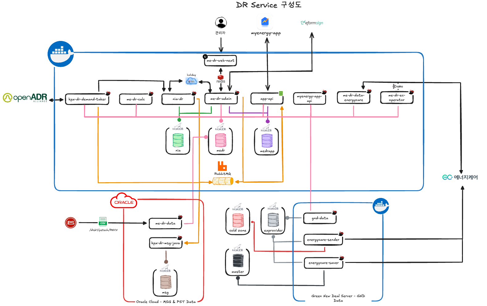

# DR 수요 자원 서비스

## Overview

| 항목 | 내용 |
|------|------|
| 기간 | 2024.08 ~ 현재 (운영 중) |
| 역할 | 풀스택 개발 + 시스템 설계 + 외주 관리 |
| 규모 | 2,363세대 / 18단지 (서울시·전주시·KPX 직접) |
| 도메인 | 수요 반응(Demand Response) 에너지 관리 플랫폼 |

---

## Tech Stack

| 분류 | 기술 |
|------|------|
| Backend | Java 17/21 / Spring Boot 3.x / MyBatis |
| Frontend | Next.js 15 / React 19 / TypeScript / TailwindCSS |
| Mobile | React Native / Expo (외주 관리) |
| Protocol | OpenADR 2.0b (OADR) |
| Message | 카카오 알림톡 / i-Heart Agent |
| Message Queue | RabbitMQ / Apache Kafka |
| Database | MySQL / MariaDB |
| Infra | Docker / GitLab CI/CD |

---

## Architecture

### 시스템 구성

| 구성요소 | 설명 |
|----------|------|
| **KPX/OpenADR** | 한국전력거래소 수요자원 명령 수신 |
| **Core Services** | me-dr-calc, me-dr-admin, app-api 등 핵심 비즈니스 로직 |
| **Message Queue** | RabbitMQ + Kafka (서울시 발령 연동) |
| **Multi DB** | min, medr, medrapp 용도별 분리 운영 |
| **Cold Zone** | 대용량 데이터 파티셔닝 및 아카이빙 |
| **Oracle Cloud** | MSG & PST 데이터 수집 |
| **Green New Deal Server** | 회사 자체 AMI 검침 데이터 (전주시 15분 데이터 제공) |
| **EnergyKare** | 한전 에너지케어 양방향 연동 |

### 서비스 구성

| 서비스 | 역할 |
|--------|------|
| **kpx-dr-demand-taker** | KPX DR 명령 수신 (OpenADR 2.0b) |
| **kpx-dr-msg-java** | i-Heart 메시지 전송 서비스 |
| **me-dr-admin** | 관리자 백엔드 API |
| **me-dr-web-next** | 관리자 웹 대시보드 |
| **me-dr-data** | 계량기 데이터 수집 (6개 벤더) |
| **me-dr-calc** | 정산 계산 배치 서비스 |
| **if-energycare-saver** | 에너지케어 데이터 동기화 |
| **if-energycare-sender** | LP 데이터 전송 |
| **me-dr-ec-operator** | 에너지케어 운영 관리 |

---

## What I Did

### KPX OpenADR 연동 시스템
- OpenADR 2.0b 프로토콜 기반 KPX 수요자원 연동 구현
- 5.1 Party Registration / 5.3 Event / 5.4 Poll 스펙 준수
- DR 이벤트 수신 → 메시지 발송 → 정산 파이프라인 자동화

### CBL(소비 기준선) 알고리즘 엔진
[CBL 알고리즘 상세 문서](./cbl-algorithm.md)

- Mid 8/10 방식 기반 CBL 계산 엔진 설계 및 구현
- 7가지 핵심 지표 산출 (CBL, 절감량, 절감률, 증감량, 증감률, 표준편차 등)
- 다수의 CBL 계산 알고리즘 타입 구현 (주중/주말/공휴일 별도 설정)
- 이벤트 유형별 차등 보상 계산 로직
- 서울시 자체 발령 / 미세먼지 이벤트 등 특수 케이스 처리
- 배치 쿼리 최적화로 99% 쿼리 감소, CBL 타입 그룹화로 95% 설정 조회 감소

### 에너지케어 양방향 연동
- 한전 에너지케어 API 연동 (15분 단위 실시간 데이터)
- 데이터 제공자 + 서비스 제공자 역할 동시 수행
- LP 데이터 전송 및 동기화 서비스 구축

### 멀티 벤더 계량기 데이터 수집
- 6개 벤더 데이터 통합 (PST, OMS, NRF, CNU, TDE, LSE)
- 5종 CSV 파일 포맷 파싱 및 정규화
- 전주시 자체 대용량 DB 연동

### 메시지 알림 시스템
- 카카오 알림톡 연동 (DR 발령 알림)
- i-Heart 에이전트 문자 발송 서비스
- 이벤트 타입별 알림 템플릿 관리

### 프론트엔드 전면 재구축
- HTML/CSS/JS → Next.js 15 + React 19 마이그레이션
- 관리자 대시보드 UI/UX 설계 및 구현
- 반응형 웹 + 데이터 시각화

### 백엔드 아키텍처 개선
- JPA → MyBatis 리팩토링 (쿼리 관리 용이성)
- 4계층 아키텍처 설계 (boot, domain, service, store)
- Spring Boot 3.x 마이그레이션

### 대용량 데이터 파이프라인 및 DB 운영
- 5종 에너지 데이터 수집·적재 시스템 구축 (전기 140GB/7개월)
- DB 튜닝: innodb_buffer_pool 128MB → 20GB 조정으로 조회 성능 대폭 개선
- 테이블 파티셔닝 전략 설계 및 적용
- Cold Zone 분리로 Hot/Cold 데이터 효율적 관리
- 인덱싱 최적화로 쿼리 성능 향상
- 다중 DB 인스턴스 운영 (min, medr, medrapp)

### 메시지 큐 아키텍처
- RabbitMQ 기반 비동기 이벤트 처리
- Kafka 연동으로 서울시 DR 발령 실시간 수신
- DR 이벤트 → 메시지 발송 파이프라인 구축

### 모바일 앱 서비스
- React Native/Expo 기반 DR 참여 앱 외주 개발 관리
- 앱-백엔드 API 연동 설계 및 지원
- 푸시 알림 연동 (DR 발령 알림)

---

## Key Features

| 기능 | 설명 |
|------|------|
| **DR 이벤트 관리** | KPX 발령 수신, 이벤트 유형별 처리, 참여 세대 관리 |
| **실시간 모니터링** | 15분 단위 에너지 소비량 추적, 절감량 실시간 계산 |
| **정산 시스템** | CBL 기반 절감량 산정, 이벤트별 보상 계산, 정산 리포트 |
| **알림 서비스** | DR 발령 즉시 알림, 참여 결과 안내, 보상 지급 알림 |
| **관리자 대시보드** | 세대/단지 관리, 이벤트 현황, 정산 내역 조회 |
| **에너지케어 연동** | 한전 데이터 송수신, 서비스 제공자 역할 수행 |
| **모바일 앱** | DR 참여 현황, 절감량 확인, 보상 내역, 푸시 알림 |

---

## Metrics

| 지표 | 수치 |
|------|------|
| 운영 규모 | 2,363세대 / 18단지 |
| 마이크로서비스 | 10+ 서비스 |
| 벤더 연동 | 6개 (PST, OMS, NRF, CNU, TDE, LSE) |
| 데이터 규모 | 전기 140GB / 7개월 |
| DB 튜닝 | innodb_buffer_pool 128MB → 20GB |
| 데이터 갱신 | 15분 (에너지케어/GND 실시간) |
| DB 인스턴스 | 3개 (min, medr, medrapp) + Cold Zone |

---

[← Back to Portfolio](../../README.md)
