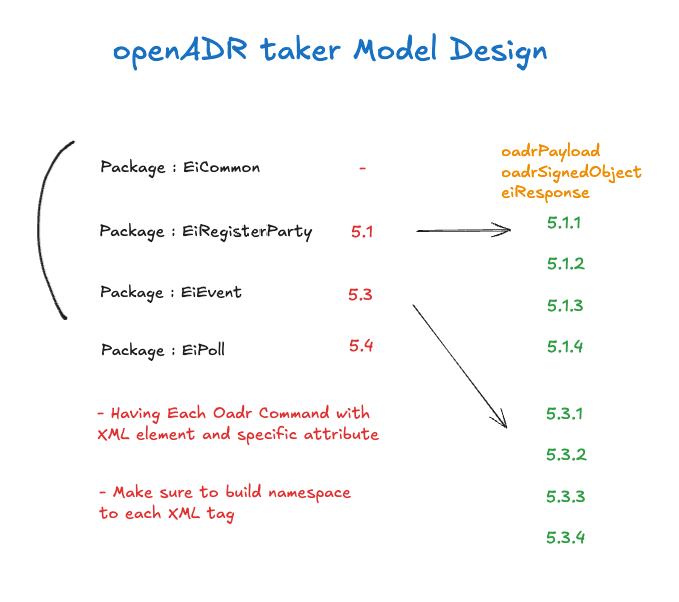

# OpenADR 프로토콜

## OpenADR 2.0b 개요

OpenADR(Open Automated Demand Response)은 전력 수요 관리를 위한 국제 표준 프로토콜입니다.

| 항목 | 설명 |
|------|------|
| 표준 | OpenADR 2.0b |
| 통신 방식 | XML 기반 HTTP/HTTPS |
| 역할 | VEN(Virtual End Node) - DR 발령 수신 |
| 연동 대상 | KPX(한국전력거래소) VTN |

---

## 모델 설계



### 패키지 구조

| 패키지 | 스펙 | 엔티티 |
|--------|------|--------|
| **EiCommon** | - | oadrPayload, oadrSignedObject, eiResponse |
| **EiRegisterParty** | 5.1 | 5.1.1 ~ 5.1.4 (등록 프로세스) |
| **EiEvent** | 5.3 | 5.3.1 ~ 5.3.4 (이벤트 프로세스) |
| **EiPoll** | 5.4 | 폴링 프로세스 |

---

## 프로토콜 상세

### 5.1 EiRegisterParty (등록)

VEN을 VTN에 등록하고 식별자(gwVenId, gwRegId)를 발급받는 프로세스입니다.

| 단계 | 메시지 | 방향 | 설명 |
|------|--------|------|------|
| 5.1.1 | oadrQueryRegistration | VEN → VTN | 등록 정보 쿼리 |
| 5.1.2 | oadrCreatedPartyRegistration | VTN → VEN | 쿼리 응답 |
| 5.1.3 | oadrCreatePartyRegistration | VEN → VTN | 등록 생성 요청 |
| 5.1.4 | oadrCreatedPartyRegistration | VTN → VEN | gwVenId, gwRegId 발급 |

### 5.3 EiEvent (이벤트)

DR 이벤트를 요청하고 수신하는 프로세스입니다.

| 단계 | 메시지 | 방향 | 설명 |
|------|--------|------|------|
| 5.3.1 | oadrRequestEvent | VEN → VTN | 이벤트 요청 |
| 5.3.2 | oadrDistributeEvent | VTN → VEN | 이벤트 배포 |
| 5.3.3 | oadrCreatedEvent | VEN → VTN | 이벤트 수신 확인 |

### 5.4 OadrPoll (폴링)

신규 또는 수정된 이벤트를 큐 방식으로 조회합니다.

- venId 기반 폴링 요청
- 대기 중인 이벤트 순차 수신

---

## XML 네임스페이스

```
OADR:    http://openadr.org/oadr-2.0b/2012/07
EI:      http://docs.oasis-open.org/ns/energyinterop/201110
PAYLOAD: http://docs.oasis-open.org/ns/energyinterop/201110/payloads
EMIX:    http://docs.oasis-open.org/ns/emix/2011/06
XCAL:    urn:ietf:params:xml:ns:icalendar-2.0
STRM:    urn:ietf:params:xml:ns:icalendar-2.0:stream
```

---

## KPX 특화 구현

### 인증 및 식별

| 항목 | 설명 |
|------|------|
| **venName** | VEN 식별의 실질적 필수값 (수요관리사업자 명칭) |
| **venId** | 등록 후 발급되는 gwVenId |
| **regId** | 등록 후 발급되는 gwRegId |
| **인증서** | 요청 시 인증서 기반 통신 권장 |

### 응답 코드

| 코드 | 설명 |
|------|------|
| 200 | 정상 처리 (파라미터 오류 포함) |
| 406 | XML 문법 오류 |

### 설정 예시

```yaml
openadr:
  ven_name: "20210100002972"
  full-path: "http://dras.kmos.kr/OpenADR2/Simple/2.0b"
  schemaVersion: 2.0b
  services:
    ei_event:
      path: "/EiEvent"
    ei_register_party:
      path: "/EiRegisterParty"
    oadr_poll:
      path: "/OadrPoll"
```

---

## 기술 스택

| 항목 | 기술 |
|------|------|
| Framework | Spring Boot 3.x |
| Language | Java 17 |
| XML Binding | JAXB 4.0 |
| HTTP Client | HttpClient5 |
| Architecture | 4계층 (boot, domain, service, store) |

---

[← Back to DR Service](./README.md) | [← Back to Portfolio](../../README.md)
