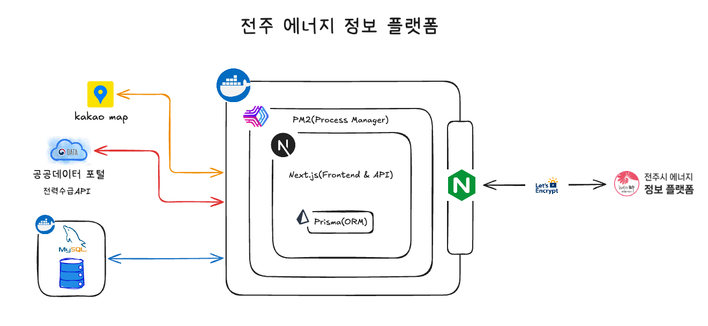

# 전주 에너지 정보 플랫폼

## Overview

| 항목 | 내용 |
|------|------|
| 기간 | 2024.04 ~ 2024.06 (개발) / 현재 운영 중 |
| 역할 | 풀스택 단독 개발 |
| 규모 | 365세대 / 18단지 공동주택 에너지 플랫폼 |
| 링크 | [jeonju.myenergy.co.kr](https://jeonju.myenergy.co.kr/) |

---

## Tech Stack

| 분류 | 기술 |
|------|------|
| Frontend | Next.js 13 / React 18 / TailwindCSS |
| Backend | Next.js API Routes |
| Database | MySQL / Prisma ORM |
| 시각화 | ApexCharts |
| 지도 | 카카오맵 API |
| 외부 API | 전력거래소(KPX) 공공데이터 |

---

## Architecture

| 구성요소 | 설명 |
|----------|------|
| **Docker** | 컨테이너 기반 배포 환경 |
| **PM2** | Next.js 프로세스 관리 (자동 재시작, 클러스터 모드) |
| **Next.js** | Frontend SSR + API Routes (포트 4000) |
| **Prisma** | 타입 안전 ORM (MySQL 연동) |
| **Nginx** | 리버스 프록시 + SSL 터미네이션 |
| **Let's Encrypt** | HTTPS 인증서 자동 갱신 |
| **외부 연동** | Kakao Map API, 공공데이터포털 전력수급 API, MySQL DB |

---

## What I Did

### 데이터 시각화 시스템
- ApexCharts 기반 5가지 차트 컴포넌트 구현 (Donut, Stacked Column, Stacked Area, Bar-Line, YoY Bar)
- 한국전력거래소(KPX) 실시간 전원구성 API 연동 (5분 단위 갱신, 9개 발전원 분류)
- 반응형 차트 설계: 모바일/데스크톱 별도 옵션 + 한국어 숫자 포맷팅

### 지도 기반 에너지 정보 시스템
- Kakao Map CustomOverlay 기반 동적 핀 렌더링
- 줌 레벨 기반 핀 크기 자동 조정 알고리즘 구현
- 3가지 핀 타입 지원 (태양광 설비, 공동주택, 행정구역) + 색상 코딩
- 호버/클릭 인터랙션 및 지도-리스트 스크롤 동기화

### 검색 및 데이터 처리
- 한글 자음 분해 기반 부분 문자열 검색 알고리즘 구현 (매칭 횟수 정렬)
- Prisma groupBy + 집계 함수로 연도별/용도별 에너지 데이터 집계
- SWR 캐싱 + 400ms 디바운싱으로 API 호출 최적화

### 환경 영향 가시화
- 에너지 절감량 → CO₂ 감소량 → 나무 그루 수 변환 로직 구현
- 계단식 캐시백 인센티브 계산 시스템 (kWh 구간별 차등 적용)

### 인프라 및 배포
- Docker 컨테이너 기반 배포 환경 구축
- Nginx 리버스 프록시 + Let's Encrypt SSL 인증서 자동 갱신 설정
- PM2 프로세스 매니저로 무중단 운영 환경 구성

---

## Key Features

| 기능 | 설명 |
|------|------|
| **에너지 대시보드** | 전주시 전력/가스 소비 현황, 온실가스 배출량, 실시간 전원구성 시각화 |
| **태양광 설비 현황** | 구/유형/연도별 필터링, 지도 기반 위치 표시, 연간 발전량 예측 |
| **공동주택 에너지 추적** | 아파트별 월별 소비량 비교, 계절별 추이 분석, 캐시백 예측 |
| **지역별 에너지 분석** | 행정구역별 전기/가스 소비량, 용도별 분류(주택/산업/일반), YoY 비교 |
| **탄소 절감 캠페인** | 에너지 쉼표/소등행사 참여 현황, 환경 기여도(나무 그루 수) 표시 |
| **실시간 전력수급** | KPX API 연동, 5분 단위 갱신, 9개 발전원별 현황 |

---

## Metrics

| 지표 | 수치 |
|------|------|
| 운영 규모 | 365세대 / 18단지 |
| 개발 기간 | 3개월 |
| 데이터 갱신 | 5분 (실시간 전력수급) |

---

[← Back to Portfolio](../../README.md)
