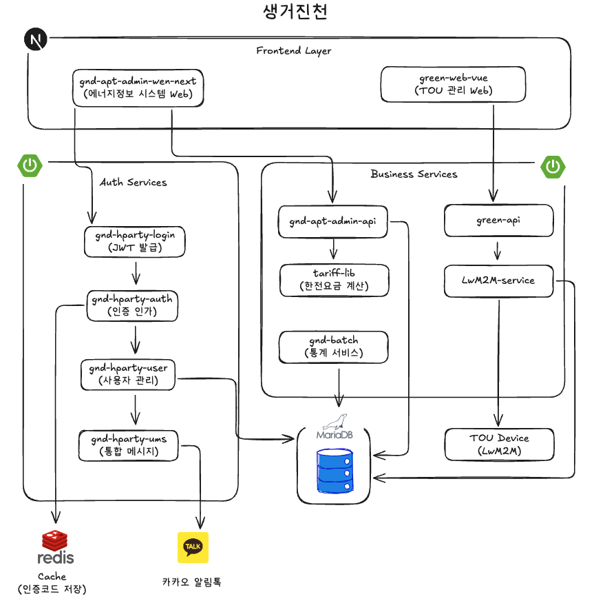

# 생거진천 에너지 정보 시스템

## Overview

| 항목 | 내용 |
|------|------|
| 기간 | 2025.01 ~ 2025.03 (개발 중) |
| 역할 | 풀스택 개발 + 화면 기획 + 시스템 설계 |
| 협력사 | 진천군 + 한전 |
| 도메인 | 스마트 미터링 기반 에너지 정보 플랫폼 |

---

## Tech Stack

| 분류 | 기술 |
|------|------|
| Backend | Java 8 / Spring Boot 2.2.6 / MyBatis / Spring Security / GraphQL |
| Frontend | Next.js 15 / React 19 / Vue 3 / TypeScript / TailwindCSS |
| Auth | JWT / HParty 인증 서비스 / Redis (인증코드 캐시) |
| Database | MariaDB |
| Message | 카카오 알림톡 |
| Design | Atomic Design Pattern / Figma MCP |
| Infra | Docker / GitLab CI/CD |

---

## Architecture

### 시스템 구성

| 구성요소 | 설명 |
|----------|------|
| **Frontend Layer** | Next.js 관리자 웹 + Vue TOU 관리 화면 |
| **Auth Services** | 로그인/인증/사용자 관리 마이크로서비스 (HParty) |
| **Business Services** | 관리자 API + 한전 요금 계산 + 통계 배치 + TOU 연동 |
| **Data Layer** | MariaDB + Redis (인증코드 캐시) |
| **External** | 카카오 알림톡 + TOU Device (LwM2M) |

### 서비스 구성

| 서비스 | 역할 |
|--------|------|
| **gnd-apt-admin-web-next** | 관리자 웹 대시보드 (아토믹 디자인) |
| **green-web-vue** | TOU 관리 프론트엔드 |
| **gnd-hparty-login** | JWT 토큰 발급 |
| **gnd-hparty-auth** | 권한 검증 서비스 |
| **gnd-hparty-user** | 사용자 CRUD |
| **gnd-hparty-ums** | 통합 메시지 발송 (카카오 알림톡) |
| **gnd-apt-admin-api** | 관리자 백엔드 API |
| **tariff-lib** | 한전 요금 계산 라이브러리 |
| **gnd-batch** | 통계 서비스 (15분→시간/일/월 집계) |
| **green-api** | TOU GraphQL API 서버 |
| **LwM2M-service** | TOU 장치 통신 서비스 |

---

## What I Did

### 아토믹 디자인 시스템 구축
- Figma MCP 연동으로 디자인 토큰 자동 동기화
- 4계층 컴포넌트 구조 설계 및 구현
  - **Atoms**: Button, Input, Label, Checkbox 등 17개 기본 요소
  - **Molecules**: FormField, SearchBar, DataCard 등 6개 조합 요소
  - **Organisms**: Header, Sidebar, DataTable 등 복합 컴포넌트
  - **Templates**: DashboardTemplate, ListTemplate 등 페이지 레이아웃
- 재사용 가능한 컴포넌트 라이브러리 구축

### RBAC 권한 기반 접근 제어
- 3단계 역할 체계 설계 및 구현
  - R001 (admin): 시스템 전체 관리
  - R002 (manager): 단지 관리자
  - R003 (operator): 운영자
- AOP 기반 권한 검증 로직 구현
- JWT 토큰 기반 인증 플로우 설계
- HParty 마이크로서비스 연동 (login/auth/user/ums)

### 한전 요금 계산 인터페이스

> 📄 [KEPCO 요금 계산 알고리즘 상세 문서](./kepco-tariff-algorithm.md)

- nuri-energy-tariff-lib 라이브러리 분석 및 연동
- 요금종별 계산 로직 구현
  - 일반용(갑/을)II 고압A: 시간대별 요금 (경부하/중간/최대)
  - 주택용(저압/고압): 3구간 누진제 + 하계 구간 확대
  - 심야전력(을)II: 심야/주간 구분 요금
- 계절별 요금 구간 처리 (하계/기타계절)
- 복지 할인 적용 (독립유공자, 장애인, 대가족 등)
- 부가가치세, 전력산업기반기금, 기후환경요금, 연료비조정액 계산

### TOU 관리 시스템 구축
- Vue 3 기반 TOU 관리 프론트엔드 화면 개발
- GraphQL API 서버 (green-api) 연동
- TOU 파일 업로드/다운로드 기능 구현
- TOU 설정 이력 관리 기능

### 프론트엔드 전면 재구축
- 기존 React 17 → Next.js 15 + React 19 마이그레이션
- TypeScript 전면 적용
- TailwindCSS 기반 스타일 시스템

### API 문서 생성 자동화
- Claude Code 에이전트 설계
- 기획서 → Excel API 문서 자동 생성 워크플로우 구축

---

## Key Features

| 기능 | 설명 |
|------|------|
| **에너지 모니터링** | 15분 단위 전력 사용량 실시간 조회 |
| **요금 계산** | 한전 요금 체계 기반 예상 요금 산출 |
| **사용자 관리** | 세대/단지/운영자 계정 CRUD |
| **TOU 제어** | 시간대별 요금 장치 원격 제어 |
| **권한 관리** | 역할 기반 메뉴/기능 접근 제어 |
| **대시보드** | 단지별 에너지 사용 현황 시각화 |

---

## Metrics

| 지표 | 수치 |
|------|------|
| 마이크로서비스 | 11개 (admin-web, admin-api, login, auth, user, ums, batch, green-web, green-api, LwM2M-service, tariff-lib) |
| 아토믹 컴포넌트 | 17 atoms / 6 molecules / 4 organisms |
| 역할 체계 | 3단계 (admin/manager/operator) |
| 요금종별 | 2종 (TRF01/TRF02) + 복지할인 7종 |

---

[← Back to Portfolio](../../README.md)
