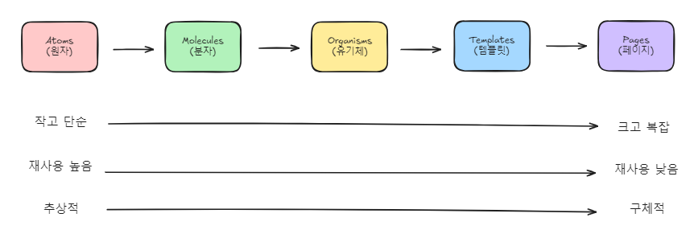
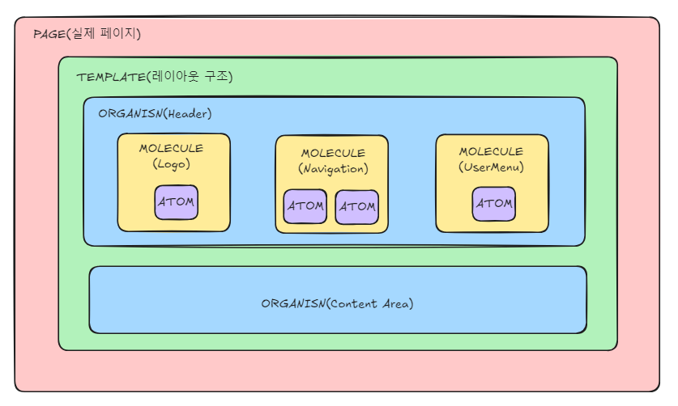

# Atomic Design System

## 개요

화학의 원자 개념을 UI 설계에 적용한 디자인 시스템

```
원자(Atom) → 분자(Molecule) → 유기체(Organism) → 템플릿(Template) → 페이지(Page)
```

---

## 필요한 이유

### 기존 방식의 문제점

```
페이지 단위로 개발
→ 비슷한 버튼, 입력창을 페이지마다 새로 생성
→ 디자인 일관성 X + 코드 중복 + 유지보수 어려움
```

### Atomic Design의 해결

```
작은 단위부터 설계
→ 조합해서 큰 단위 구성
→ 일관성 유지 + 재사용 + 유지보수 용이
```

---

## 5단계 계층 구조





### Atoms (원자)

더 이상 분해할 수 없는 가장 작은 UI 단위

| 예시 | 설명 |
|------|------|
| Button | 기본 버튼 컴포넌트 |
| Input | 입력 필드 |
| Label | 텍스트 레이블 |
| Checkbox | 체크박스 |
| Icon | 아이콘 |

### Molecules (분자)

Atoms를 조합하여 하나의 기능을 수행하는 단위

| 예시 | 구성 |
|------|------|
| FormField | Label + Input + ErrorMessage |
| SearchBar | Input + Button |
| DataCard | Icon + Label + Value |

### Organisms (유기체)

Molecules와 Atoms를 조합한 독립적인 UI 섹션

| 예시 | 구성 |
|------|------|
| Header | Logo + Navigation + UserMenu |
| Sidebar | MenuItems + UserProfile |
| DataTable | TableHeader + TableRows + Pagination |

### Templates (템플릿)

페이지의 레이아웃 구조를 정의 (콘텐츠 없음)

| 예시 | 설명 |
|------|------|
| DashboardTemplate | 대시보드 페이지 레이아웃 |
| ListTemplate | 목록 페이지 레이아웃 |
| DetailTemplate | 상세 페이지 레이아웃 |

### Pages (페이지)

Templates에 실제 데이터와 콘텐츠가 주입된 최종 결과물

| 예시 | 템플릿 |
|------|--------|
| 에너지 대시보드 | DashboardTemplate + 실제 데이터 |
| 세대 목록 | ListTemplate + 세대 정보 |
| 세대 상세 | DetailTemplate + 세대 상세 데이터 |

---

## SJC 프로젝트 적용 현황

| 계층 | 구현 수 | 주요 컴포넌트 |
|------|---------|---------------|
| Atoms | 17개 | Button, Input, Label, Checkbox, Select, Badge, ... |
| Molecules | 6개 | FormField, SearchBar, DataCard, TabMenu, ... |
| Organisms | 4개 | Header, Sidebar, DataTable, Modal |
| Templates | 2개 | DashboardTemplate, ListTemplate |

### 폴더 구조

```
src/
├── components/
│   ├── atoms/
│   │   ├── Button/
│   │   ├── Input/
│   │   ├── Label/
│   │   └── ...
│   ├── molecules/
│   │   ├── FormField/
│   │   ├── SearchBar/
│   │   └── ...
│   ├── organisms/
│   │   ├── Header/
│   │   ├── Sidebar/
│   │   └── ...
│   └── templates/
│       ├── DashboardTemplate/
│       └── ListTemplate/
└── app/
    └── (pages)/
```

---

## Figma MCP 연동

디자인 토큰 자동 동기화를 통한 디자인-개발 일관성 유지

```
Figma 디자인 시스템
    ↓ (MCP 연동)
Design Tokens (colors, spacing, typography)
    ↓
TailwindCSS Config
    ↓
React Components
```

---

[← Back to SJC Portfolio](./README.md)
